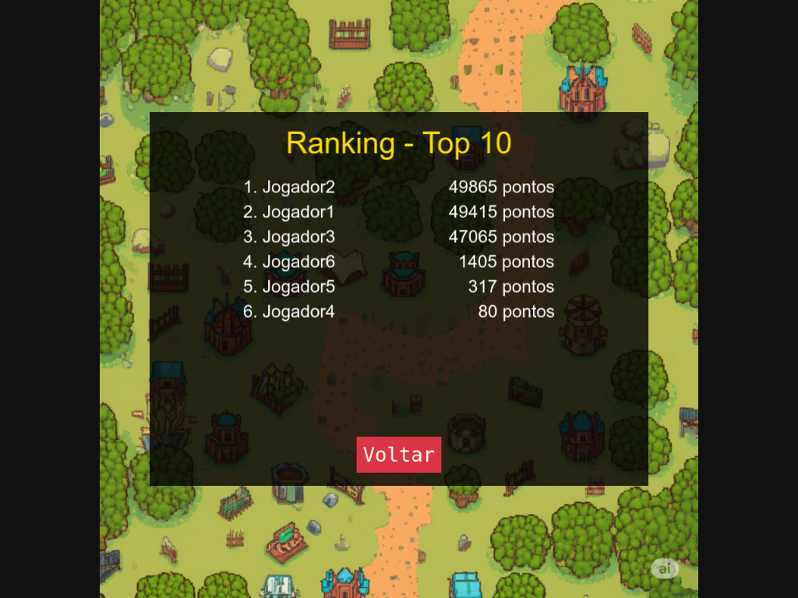
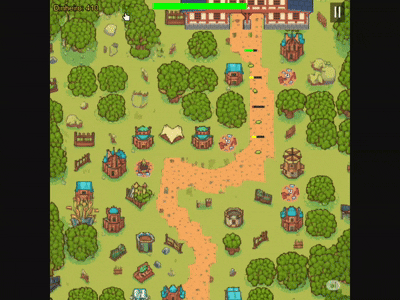

# Game Design Document & Storyboards

*Este documento foi elaborado como parte da primeira etapa avaliativa do projeto final da disciplina de Sistemas Multimídia, detalhando a concepção inicial, os elementos visuais e o fluxo de jogo do projeto "Village Defense: A Defesa da Vila Arqueira".*

---

### **Grupo de Trabalho**
* Pedro Eduardo Lemos Sousa

---

### **1. Roteiro e Narrativa do Jogo**

**Título:** A Defesa da Vila Arqueira

**Narrativa:**
Num vale isolado e pacífico, reside uma pequena vila medieval cuja única fama vem da sua incomparável habilidade com o arco e flecha. A vida é tranquila, até que, subitamente, as criaturas que habitam as florestas começam a atacar os caminhos que levam à vila, corrompidas por uma magia negra e desconhecida.

O jogador assume o papel do "Mestre Estratega" da vila, responsável por gerir os recursos e posicionar torres de arqueiros em locais estratégicos para proteger a vila da destruição. O objetivo é sobreviver a todas as hordas de inimigos em duas fases principais: os campos exteriores e os arredores da própria vila.

---

### **2. Definição dos Personagens e Elementos do Jogo**

**a) Personagens Aliados:**

* **Torre de Arqueiros:** A unidade de defesa principal do jogador. A torre pode ser evoluída através de 7 níveis, tornando-se mais poderosa e alterando a sua aparência e o tipo de arqueiro no seu topo.

**b) Personagens Inimigos:**

* **Inimigo 1 (Slime Corrompido):** Unidade básica do jogo, não possui nenhum atributo especial.
* **Inimigo 2 (Goblin da Floresta):** Unidade terrestre lenta, mas muito resistente.
* **Inimigo 3 (Lobo Corrompido):** Unidade terrestre com pouca resistência, porém muito veloz.
* **Inimigo 4 (Abelha Corrompida):** Unidade aérea que exige torres de nível mais alto para ser atingida, além de possuir mais velocidade.

**c) Elementos do Cenário:**

* **Fase 1 - Campos Exteriores:** Um ambiente rural com caminhos de terra que levam em direção à base do jogador.
* **Fase 2 - Arredores da Vila:** Um cenário mais detalhado com decorações como casas, tendas e cidadãos animados, com múltiplos caminhos de ataque.
* **Locais de Construção:** Áreas pré-definidas no mapa onde o jogador pode posicionar as suas torres.

---

### **3. Storyboards**

A sequência abaixo ilustra a jornada visual e interativa do jogador.

#### **Quadro 1: Tela Inicial**
* **Descrição:** A tela principal onde o jogador inicia a sua jornada. Apresenta as opções para começar a jogar ou verificar o ranking de pontuações.

  

#### **Quadro 2: Tela de Ranking**
* **Descrição:** Ao clicar no botão "Ranking", o jogo executa uma requisição GET à API backend. Os dados, armazenados numa base de dados MongoDB, são retornados e exibidos na tela, mostrando as melhores pontuações e demonstrando a integração full-stack do projeto.

  

#### **Quadro 3: Início da Fase 1**
* **Descrição:** O mapa da Fase 1 é exibido com a interface de jogo (vida, dinheiro). A mensagem "Horda 1" prepara o jogador para a primeira onda de inimigos.

  

#### **Quadro 4: Construção de uma Torre**
* **Descrição:** Demonstração da mecânica de construção. O jogador clica num local válido, o dinheiro é debitado, e uma torre de nível 1 é construída.

  

#### **Quadro 5: Combate**
* **Descrição:** O ciclo de jogo em ação. As torres disparam automaticamente nos inimigos, que, ao serem derrotados, concedem dinheiro ao jogador.

  

#### **Quadro 6: Upgrade da Torre**
* **Descrição:** O jogador clica numa torre para abrir a janela de upgrade. O GIF demonstra tanto um upgrade bem-sucedido quanto a mensagem de aviso por falta de dinheiro.

  

#### **Quadro 7: Compra de Vida**
* **Descrição:** Mecânica estratégica que permite ao jogador gastar dinheiro para recuperar a vida da base, crucial para a sobrevivência em hordas avançadas.

  

#### **Quadro 8: Transição de Fase**
* **Descrição:** Ao vencer a Fase 1, uma mensagem de "Fase Concluída!" é exibida, seguida de uma transição suave para a Fase 2, mantendo o dinheiro do jogador.

  

#### **Quadro 9: Fim de Jogo (Vitória)**
* **Descrição:** Tela exibida ao completar todas as hordas da última fase. O jogador é solicitado a inserir o seu nome para salvar a sua pontuação no ranking.

  

#### **Quadro 10: Fim de Jogo (Derrota)**
* **Descrição:** Tela exibida quando a vida da base chega a zero. O jogo termina, e são apresentadas as opções para jogar novamente ou voltar ao menu principal.

  

---

### **4. Implementação do Cenário e Transição de Cenas**

* **Cenários e Fases:** Foram implementadas duas fases completas (`GameScene.js` e `GameScene2.js`), cada uma com o seu próprio layout de mapa, elementos visuais e múltiplos caminhos para os inimigos.
* **Personagens e Elementos:** Os inimigos movimentam-se pelos caminhos pré-definidos em cada fase, e as torres são posicionadas pelo jogador.
* **Transição entre Cenas:** Existe uma transição entre a `GameScene` e a `GameScene2`, ativada após a vitória na primeira fase.
