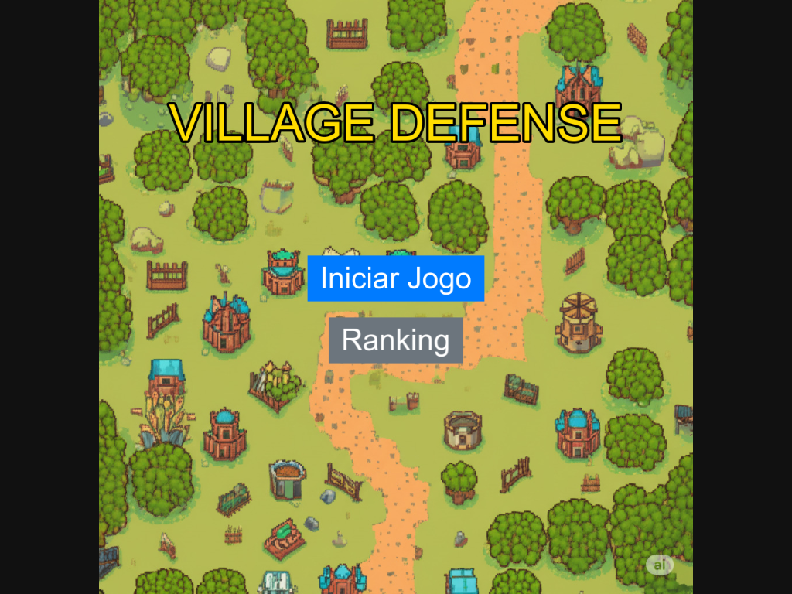
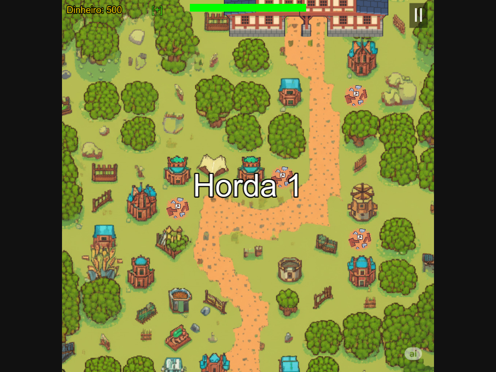
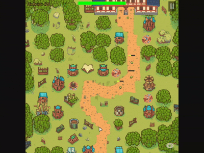
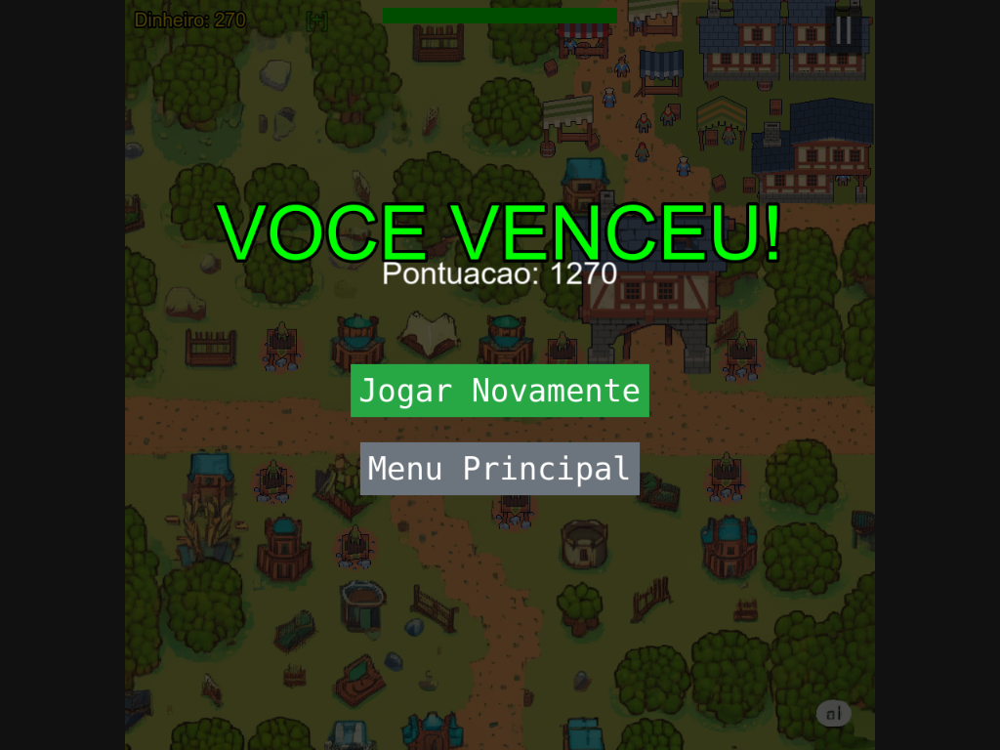
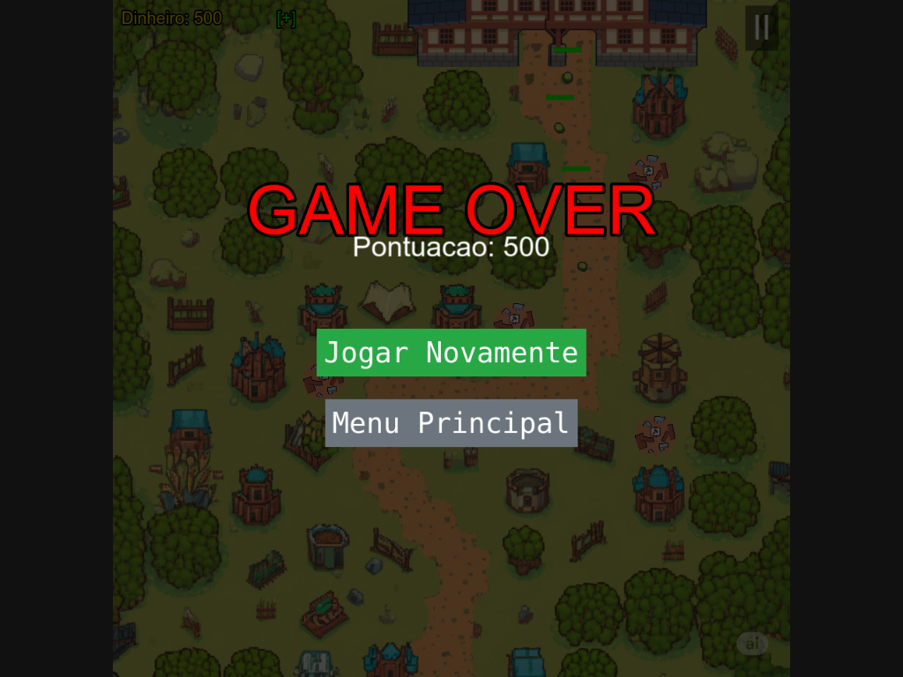

# Game Design Document (GDD): A Defesa da Vila Arqueira

*Este documento foi elaborado como parte da primeira etapa avaliativa do projeto final da disciplina, detalhando a concepção inicial, os elementos visuais e o fluxo de jogo.*

---

### **Grupo de Trabalho**
* [Pedro Eduardo Lemos Sousa]

---

### **1. Roteiro e Narrativa do Jogo**

**Título:** A Defesa da Vila Arqueira

**Narrativa:**
Num vale isolado e pacífico, reside uma pequena vila medieval cuja única fama vem da sua incomparável habilidade com o arco e flecha. A vida é tranquila, até que, subitamente, as criaturas que habitam as florestas circundantes começam a atacar os caminhos que levam à vila, corrompidas por uma magia negra e desconhecida.

O jogador assume o papel do "Mestre Estratega" da vila, responsável por gerir os recursos e posicionar torres de arqueiros em locais estratégicos para proteger a vila da destruição. O objetivo é sobreviver a todas as hordas de inimigos em duas fases principais: os campos exteriores e os arredores da própria vila.

---

### **2. Definição dos Personagens e Elementos do Jogo**

**a) Personagens Aliados:**

* **Torre de Arqueiros:** A unidade de defesa principal do jogador. A torre pode ser evoluída através de 7 níveis, tornando-se mais poderosa e alterando a sua aparência e o tipo de arqueiro no seu topo.

**b) Personagens Inimigos:**

* **Inimigo 1 (Slime Corrompido):** Unidade básica do jogo, não possui nenhum atributo especial.
* **Inimigo 2 (Goblin da Floresta):** Unidade terrestre lenta, mas muito resistente.
* **Inimigo 3 (Lobo Corrompido):** Unidade terrestre com pouca resistência, porém muito veloz.
* **Inimigo 4 (Abelha Corrompida):** Unidade aérea que exige torres de nível mais alto para ser atingida, além de possuir mais velocidade.

**c) Elementos do Cenário:**

* **Fase 1 - Campos Exteriores:** Um ambiente rural com caminhos de terra que levam em direção à base do jogador.
* **Fase 2 - Arredores da Vila:** Um cenário mais detalhado com decorações como casas, tendas e cidadãos animados, com múltiplos caminhos de ataque.
* **Locais de Construção:** Áreas pré-definidas no mapa onde o jogador pode posicionar as suas torres.

---

### **3. Storyboards**

#### **Quadro 1: Tela Inicial**
* **Descrição:** A tela principal onde o jogador inicia a sua jornada. Apresenta as opções para começar a jogar ou verificar o ranking de pontuações.

**Quadro 2: Início da Fase 1**
* **Visual:** O mapa da Fase 1 é exibido. A interface mostra a vida da base e o dinheiro inicial. Uma mensagem "Horda 1" aparece no centro do ecrã.
* **Ação:** A primeira horda de inimigos começa a mover-se pelo caminho.

**Quadro 3: Construção de uma Torre**
* **Visual:** O jogador clica num local de construção vazio.
* **Ação:** O dinheiro é debitado, e uma torre de nível 1 é construída no local selecionado.

**Quadro 4: Combate**
* **Visual:** As torres disparam automaticamente flechas nos inimigos que entram no seu raio de alcance.
* **Ação:** Inimigos derrotados desaparecem e dão dinheiro ao jogador.

**Quadro 5: Upgrade de uma Torre**
* **Visual:** O jogador clica numa torre existente, e uma janela de upgrade aparece, mostrando o custo e a melhoria nos atributos.
* **Ação:** O jogador confirma o upgrade, o dinheiro é gasto e a torre muda de aparência, tornando-se mais forte.

**Quadro 6: Comprando Vida**
* **Visual:** A barra de vida é incrementada, aumentando a vida do jogador.
* **Ação:** 

**Quadro 7: Vitória na Fase 1**
* **Visual:** Após derrotar a última horda da fase, uma mensagem de "Fase Concluída!" é exibida.
* **Ação:** O jogo prepara a transição para a próxima fase.

**Quadro 8: Fim de Jogo (Vitória)**
* **Visual:** O jogador vence todas as hordas da Fase 2. Uma tela perguntando o nome do jogador aparece, seguindo de uma tela de "GAME WIN".
* **Ação:** O jogador pode escolher entre "Jogar Novamente" ou "Menu Principal".

**Quadro 8: Fim de Jogo (Derrota)**
* **Visual:** A vida da base chega a zero. Uma tela perguntando o nome do jogador aparece, seguido de uma tela de "GAME OVER".
* **Ação:** O jogador pode escolher entre "Jogar Novamente" ou "Menu Principal".

---

### **4. Implementação do Cenário e Transição de Cenas**

* **Cenários e Fases:** Foram implementadas duas fases completas (`GameScene.js` e `GameScene2.js`), cada uma com o seu próprio layout de mapa, elementos visuais e caminhos para os inimigos.
* **Personagens e Elementos:** Os inimigos movimentam-se pelos caminhos pré-definidos em cada fase.
* **Transição entre Cenas:** Existe uma transição entre a `GameScene` e a `GameScene2`, ativada após a vitória na primeira fase.

