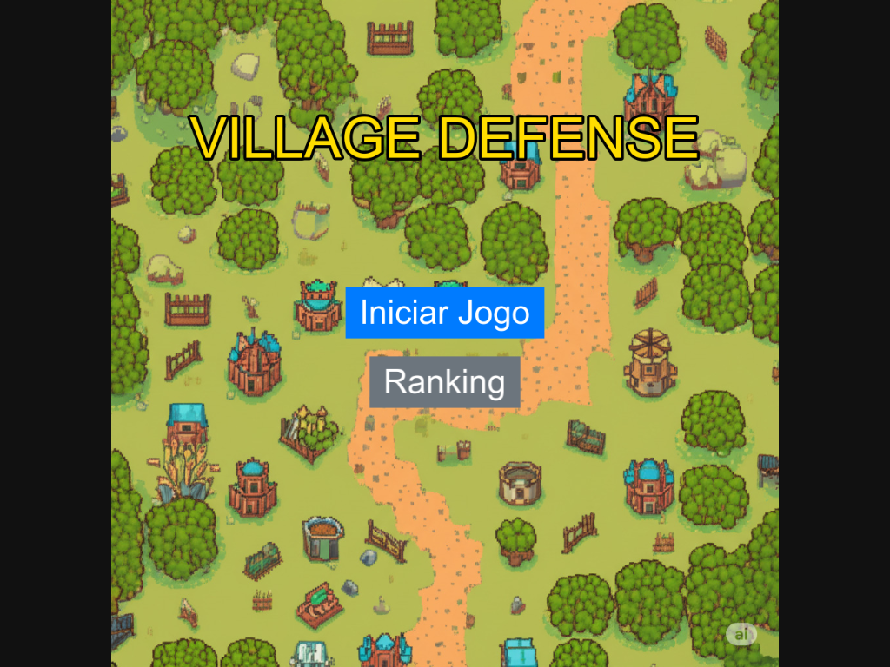
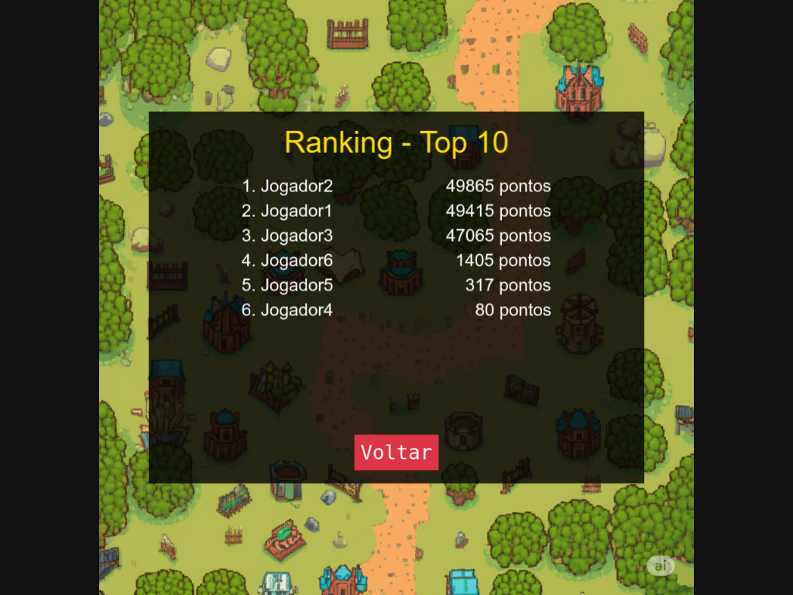
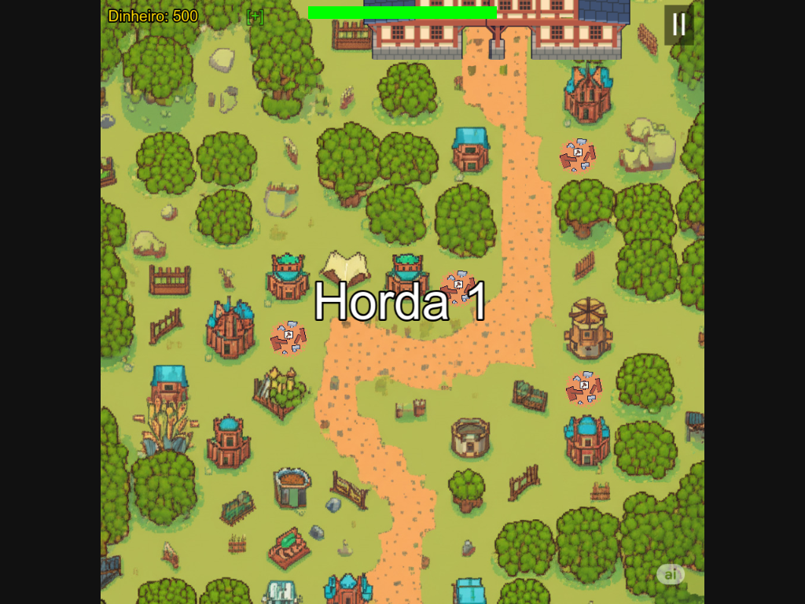
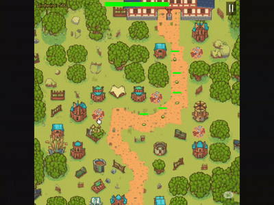
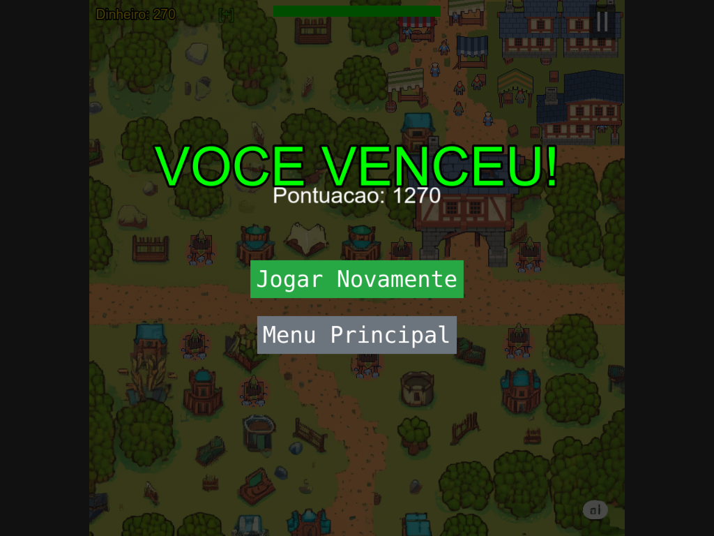
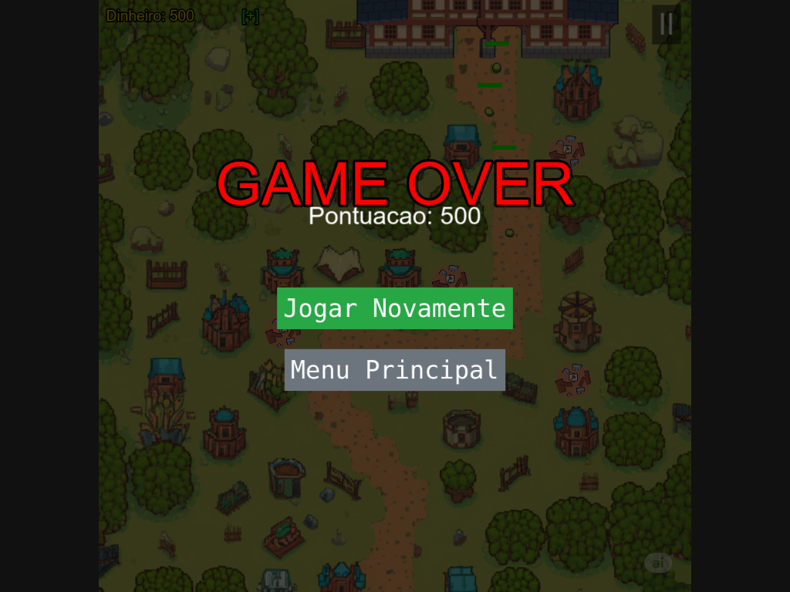

# Village Defense: A Defesa da Vila Arqueira

Um jogo de Tower Defense desenvolvido com Phaser 3, Node.js e MongoDB, criado como projeto final da disciplina de Sistemas Multimídia.

---

## 📜 Índice

1.  [**Visão Geral do Projeto**](#1-visão-geral-do-projeto)
2.  [**Links Importantes**](#2-links-importantes)
3.  [**Roteiro e Narrativa**](#3-roteiro-e-narrativa)
4.  [**Personagens e Elementos**](#4-personagens-e-elementos)
5.  [**Storyboards**](#5-storyboards)
6.  [**Considerações Técnicas**](#6-considerações-técnicas)
    * [Frontend (Phaser 3)](#frontend-phaser-3)
    * [Backend (API REST)](#backend-api-rest)
    * [Processo de Criação e Créditos](#processo-de-criação-e-ferramentas)

---

## 1. Visão Geral do Projeto

**"Village Defense: A Defesa da Vila Arqueira"** é um jogo de Tower Defense onde o jogador assume o papel de um estratega que deve proteger uma vila medieval do ataque de hordas de monstros corrompidos. O projeto abrange o desenvolvimento completo de um jogo, desde a sua conceção, passando pela implementação de mecânicas de jogo e orientação a objetos, até à integração com um backend e a finalização de múltiplas fases.

### Como Jogar
- **Objetivo:** Sobreviver a todas as hordas de inimigos sem deixar que a vida da sua base chegue a zero.
- **Construir:** Clique nos locais de construção designados no mapa para posicionar uma torre de arqueiros.
- **Evoluir:** Clique numa torre já construída para abrir o menu de upgrade e a tornar mais forte.
- **Recursos:** Ganhe dinheiro ao derrotar inimigos e use-o para construir e evoluir torres ou comprar vida para a sua base.

---

## 2. Links Importantes

<!-- * **Link para Jogar (Repl.it):** [COLOQUE AQUI O SEU LINK PÚBLICO DO REPL.IT] -->

---

## 3. Roteiro e Narrativa

Num vale isolado e pacífico, reside uma pequena vila medieval cuja única fama vem da sua incomparável habilidade com o arco e flecha. A vida é tranquila, até que, subitamente, as criaturas que habitam as florestas começam a atacar os caminhos que levam à vila, corrompidas por uma magia e desconhecida.

O jogador assume o papel do "Mestre Estrategista" da vila, responsável por gerir os recursos e posicionar torres de arqueiros em locais estratégicos para proteger a vila da destruição. O objetivo é sobreviver a todas as hordas de inimigos em duas fases principais: os campos exteriores e os arredores da própria vila.

---

## 4. Personagens e Elementos

* **Torre de Arqueiros:** A unidade de defesa principal do jogador. A torre pode ser evoluída através de 7 níveis, tornando-se mais poderosa e alterando a sua aparência e o tipo de arqueiro no seu topo.

* **Inimigo 1 (Slime Corrompido):** Unidade básica do jogo, não possui nenhum atributo especial.
* **Inimigo 2 (Goblin da Floresta):** Unidade terrestre lenta, mas muito resistente.
* **Inimigo 3 (Lobo Corrompido):** Unidade terrestre com pouca resistência, porém muito veloz.
* **Inimigo 4 (Abelha Corrompida):** Unidade aérea que exige torres de nível mais alto para ser atingida, além de possuir mais velocidade.

**c) Elementos do Cenário:**

* **Fase 1 - Campos Exteriores:** Um ambiente rural com caminhos de terra que levam em direção à base do jogador.
* **Fase 2 - Arredores da Vila:** Um cenário mais detalhado com decorações como casas, tendas e cidadãos animados, com múltiplos caminhos de ataque.
* **Locais de Construção:** Áreas pré-definidas no mapa onde o jogador pode posicionar as suas torres.

---

## 5. Storyboards

A sequência abaixo ilustra a jornada visual e interativa do jogador.

#### **Quadro 1: Tela Inicial**
* **Descrição:** A tela principal onde o jogador inicia a sua jornada. Apresenta as opções para começar a jogar ou verificar o ranking de pontuações.

  

#### **Quadro 2: Tela de Ranking**
* **Descrição:** Ao clicar no botão "Ranking", o jogo executa uma requisição GET à API backend. Os dados, armazenados numa base de dados MongoDB, são retornados e exibidos na tela, mostrando as melhores pontuações e demonstrando a integração full-stack do projeto.

  

#### **Quadro 3: Início da Fase 1**
* **Descrição:** O mapa da Fase 1 é exibido com a interface de jogo (vida, dinheiro). A mensagem "Horda 1" prepara o jogador para a primeira onda de inimigos.

  

#### **Quadro 4: Construção de uma Torre**
* **Descrição:** Demonstração da mecânica de construção. O jogador clica num local válido, o dinheiro é debitado, e uma torre de nível 1 é construída.

  

#### **Quadro 5: Combate**
* **Descrição:** O ciclo de jogo em ação. As torres disparam automaticamente nos inimigos, que, ao serem derrotados, concedem dinheiro ao jogador.

  

#### **Quadro 6: Upgrade da Torre**
* **Descrição:** O jogador clica numa torre para abrir a janela de upgrade. O GIF demonstra tanto um upgrade bem-sucedido quanto a mensagem de aviso por falta de dinheiro.

  

#### **Quadro 7: Compra de Vida**
* **Descrição:** Mecânica estratégica que permite ao jogador gastar dinheiro para recuperar a vida da base, crucial para a sobrevivência em hordas avançadas.

  

#### **Quadro 8: Transição de Fase**
* **Descrição:** Ao vencer a Fase 1, uma mensagem de "Fase Concluída!" é exibida, seguida de uma transição suave para a Fase 2, mantendo o dinheiro do jogador.

  

#### **Quadro 9: Fim de Jogo (Vitória)**
* **Descrição:** Tela exibida ao completar todas as hordas da última fase. O jogador é solicitado a inserir o seu nome para salvar a sua pontuação no ranking.

  

#### **Quadro 10: Fim de Jogo (Derrota)**
* **Descrição:** Tela exibida quando a vida da base chega a zero. O jogo termina, e são apresentadas as opções para jogar novamente ou voltar ao menu principal.

  

---

## 6. Considerações Técnicas

### Frontend (Phaser 3)
O jogo foi inteiramente desenvolvido com o framework Phaser 3, aproveitando o seu sistema de cenas para modularizar o projeto.

* **Orientação a Objetos:** Para cumprir os requisitos da Etapa Avaliativa II, a lógica dos personagens foi encapsulada em classes. `Enemy.js` controla todo o ciclo de vida dos inimigos (nascer, mover, morrer), enquanto `Tower.js` gere os seus próprios atributos (nível, dano) e ações (encontrar alvo, atacar, evoluir).
* **Gestão de Cenas:** O projeto utiliza múltiplas cenas que correm em paralelo: `MainMenuScene` para o início, `GameScene` e `GameScene2` para as fases, e uma `UIScene` que atua como uma camada de interface (HUD) persistente, gerindo o botão de pause e os menus de fim de jogo.
* **Geração Dinâmica de Hordas:** Para atender ao requisito de uma experiência de jogo longa e com dificuldade progressiva, foi criado um `WaveGenerator.js`. Esta classe gera hordas de forma procedural, misturando tipos de inimigos e aumentando os seus atributos com base no número da horda atual, garantindo um alto fator de rejogabilidade.

### Backend (API REST)
Como requisito para a Etapa Avaliativa III, foi implementado um backend para dar suporte a uma funcionalidade de Ranking.

* **Tecnologias:** A API foi construída em **Node.js** com o framework **Express.js**. A persistência dos dados é garantida por uma base de dados **MongoDB**, com a qual a aplicação interage através da biblioteca **Mongoose**.
* **Endpoints:** A API expõe dois endpoints principais:
    * `GET /ranking`: Retorna as 10 melhores pontuações registadas.
    * `POST /ranking`: Recebe o nome e a pontuação de um jogador e insere um novo registo no banco de dados.
* **Integração:** A `UIScene` do jogo comunica com estes endpoints através de requisições `fetch`, enviando a pontuação no final da partida e requisitando os dados para exibir na tela de Ranking.

### Processo de Criação e Créditos

* **Criação de Mapas Assistida por IA:** Os mapas das fases foram inicialmente montados utilizando um conjunto de *tiles* (imagens de terreno e decoração). Este conjunto foi então enviado para uma ferramenta de IA generativa com o prompt para que ela "construísse um mapa com estes elementos". Este processo acelerou drasticamente a criação de cenários visualmente interessantes.

* Os sprites utilizados para os personagens e elementos do cenário são baseados num pacote de arte gratuito criado por [**Free Game Assets (GUI, Sprite, Tilesets)**](https://itch.io/c/3550377/tower-defense-top-down-pixel-assets).

* **Link para o Pacote de Assets:**
  * **Inimigos:** [https://free-game-assets.itch.io/free-field-enemies-pixel-art-for-tower-defense](https://free-game-assets.itch.io/free-field-enemies-pixel-art-for-tower-defense)
  * **Torres e Arqueiros:** [https://free-game-assets.itch.io/free-archer-towers-pixel-art-for-tower-defense](https://free-game-assets.itch.io/free-archer-towers-pixel-art-for-tower-defense)
  * **Cidadãos:** [https://free-game-assets.itch.io/free-pixel-citizens-for-top-down-tower-defense](https://free-game-assets.itch.io/free-pixel-citizens-for-top-down-tower-defense)
  * **Tilesets (usados para protótipo dos mapas):** [https://itch.io/queue/c/3550377/tower-defense-top-down-pixel-assets?game_id=2211166&password=](https://itch.io/queue/c/3550377/tower-defense-top-down-pixel-assets?game_id=2211166&password=)
